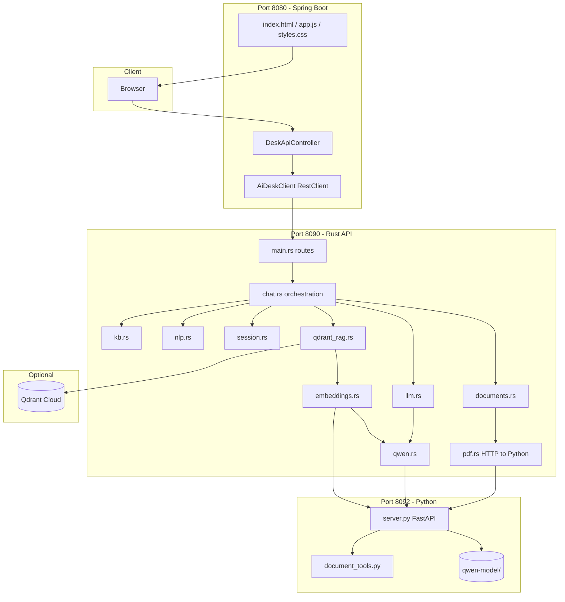

# Architecture

## System context

The NCR AI Desk is an **internal employee assistant** for NCR Tech Solutions (retail, banking, hospitality technology). It combines:

1. A **curated knowledge base** (facts compiled into Rust)
2. Optional **vector search** (Qdrant + embeddings)
3. A **small local LLM** (Qwen2.5-0.5B) for rewriting, drafting, and document work
4. A **web chat UI** with session memory and file attachments

Design goal: **directory answers should be fast and factual**; **generative tasks** use the LLM only when needed.

---

## Component diagram

---

## Request flows

### A. Directory question (e.g. IT support phone)

1. Browser `POST /api/ask` → Spring → Rust `chat::answer`
2. `nlp::classify_intent` → e.g. `contact_lookup`
3. `search_kb` — local keyword scoring and/or Qdrant vector search
4. If top score ≥ threshold → return KB entry text immediately (`engine: local` or `rag`)
5. Else if LLM available → Qwen with KB snippets in context
6. Response JSON → UI bubble

**Qwen may not run** for high-confidence KB hits.

### B. Assistant task (e.g. draft an email)

1. `nlp::is_assistant_request` → true
2. `llm::should_answer_with_llm` checks Qwen/Ollama health
3. `llm::complete_assistant` → Qwen `/chat` with assistant system prompt + optional KB context
4. Reply returned (`engine: qwen` or `ollama`)

### C. Document upload

1. Browser `POST /api/documents/upload` (multipart, max **10 MB**)
2. Spring reads bytes, forwards multipart to Rust (no broken Content-Type boundary)
3. Rust `documents::upload_document` — checks Qwen `/health`
4. Rust `pdf::extract_document_bytes` → Python `POST /documents/extract`
5. `document_tools.py` extracts text (PDF/DOCX/txt/…)
6. Rust stores `DocumentRecord` in memory + files under `.data/documents/`
7. Returns `documentId`, `filename`, `format`, counts

### D. Document edit + download

1. User asks to improve document with `documentId` in session
2. `chat::answer_with_document` → Qwen document editor prompt → full revised text
3. `documents::apply_edit` saves text, calls export → Python `/documents/export`
4. Response includes `documentEditPreview` (chat) and `documentArtifact` (download link)
5. Browser `GET /api/documents/{id}/download?sessionId=...` → Spring → Rust file bytes

### E. Casual / off-topic

1. `nlp::is_off_topic_casual` or `is_small_talk_greeting`
2. Greeting → instant welcome; casual → short LLM redirect or static fallback

---

## Technology choices

| Choice | Reason |
|--------|--------|
| Spring Boot | Mature static hosting + multipart uploads + RestClient to Rust |
| Rust API | Fast KB search, clear module boundaries, single binary |
| Python for Qwen | transformers, docx/pdf libs, fastembed ecosystem |
| Qwen2.5-0.5B | Small enough for CPU/local GPU; low latency for 0.5B |
| KB in source | Zero ops for facts; predictable answers for evaluators |
| Qdrant optional | Better semantic match without replacing KB |
| Session in memory | Simplicity; no DB for demo/internal desk |

---

## Ports and URLs

| Service | Default bind | Config |
|---------|--------------|--------|
| Spring | `localhost:8080` | `server.port` in `application.properties` |
| Rust | `127.0.0.1:8090` | `AI_DESK_BIND` |
| Qwen | `127.0.0.1:8092` | `QWEN_BIND_HOST`, `QWEN_BIND_PORT` |
| Spring → Rust | `http://127.0.0.1:8090` | `ai.desk.backend-url` |

---

## Runtime data (not in git)

| Path | Created by | Contents |
|------|------------|----------|
| `qwen-model/` | `download-model.cmd` | Hugging Face model weights |
| `.tools/qwen-venv/` | `desk.ps1` | Python virtualenv |
| `.tools/jdk17/`, `.tools/maven/` | `desk.ps1` | Optional portable JDK/Maven |
| `.data/documents/` | Rust on upload/export | Uploaded and generated files |
| `ai-service/target/` | `cargo build` | Rust build artifacts |

---

## Security notes (internal deployment)

- Binds to **localhost** by default — not exposed to LAN without explicit change
- No authentication layer in the demo — add reverse proxy + SSO for production
- `.env` holds Qdrant API key — never commit
- LLM prompts instruct not to invent phone numbers; KB is source of truth for directory facts

---

## Related docs

- [PROJECT-STRUCTURE.md](PROJECT-STRUCTURE.md) — file-level map  
- [API.md](API.md) — endpoint reference  
- [CONFIGURATION.md](CONFIGURATION.md) — environment variables  
